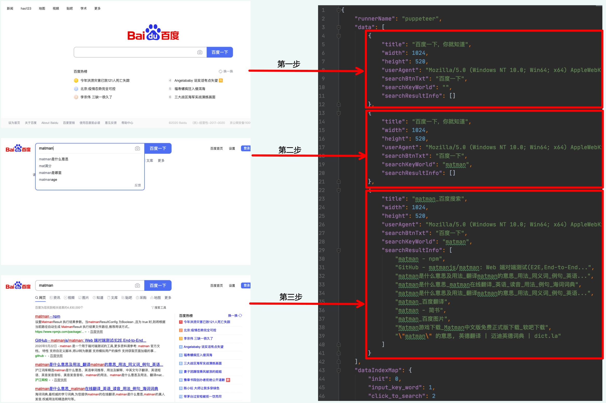

# 05. launch-options

matman 的 `launch` 启动函数的配置项目介绍。

## 1. 安装

```bash
$ npm install
```

## 2. 示例说明

### 2.1 demo_delay_before_run.js

我们以打开 https://www.baidu.com 并搜索 `matman` 为例做了一个简单的演示，体验方式：

```bash
$ node baidu.js
```

在本示例中，我们利用无头浏览器，对用户的行为进行了模拟操作，包含了三个动作：

- 动作一：开始操作之前，等待页面加载完成
- 动作二：搜索框中输入 `matman`
- 动作三：点击搜索按钮

对应的代码如下：

```js
  // 第一步：开始操作之前，等待页面加载完成
  await pageDriver.addAction('init', async page => {
    await page.waitFor('#su');
  });

  // 第二步：搜索输入框输入: matman
  await pageDriver.addAction('input_key_word', async page => {
    await page.type('#kw', 'matman');
  });

  // 第三步：点击搜索按钮，获得搜索结果
  await pageDriver.addAction('click_to_search', async page => {
    await page.click('#su');
    await page.waitFor('#content_left');
  });
```

运行上述命令之后，可以观察我们启动了一个浏览器，且按上述三个动作，浏览器进行了"播放式"自动执行。

运行结束之后，在 `build` 目录下可以看到抓包截图和运行获得的 [数据快照](https://matmanjs.github.io/matman/wiki/basic-concepts/data-snapshot.html).

```text
.
├── matman_result_output
│   └── baidu_js.json
└── screenshot_output
    └── baidu_js
        ├── baidu_js_1.png
        ├── baidu_js_2.png
        └── baidu_js_3.png
```

三个动作产生了三份数据快照，接下来就可以针对这些数据快照做校验，这个过程，也就是端对端测试的过程了。

