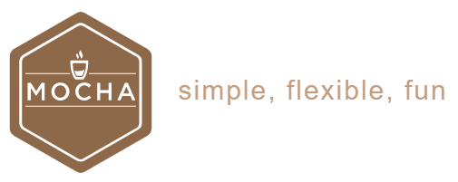

# mocha 的学习项目

[Mocha](http://mochajs.org) 是现在最流行的 JavaScript 测试框架（JavaScript test framework）之一。官方给它自己定义的三个特点是：`simple`、`flexible`、`fun`。

> Mocha is a feature-rich JavaScript test framework running on [Node.js](http://nodejs.org/) and in the browser, making asynchronous testing _simple_ and _fun_. Mocha tests run serially, allowing for flexible and accurate reporting, while mapping uncaught exceptions to the correct test cases. 

本项目为 mocha 的学习项目，根据 mocha 最常见的场景，分别有对应的学习主题和实际示例。每个学习主题所包含的技能点在 README.md 中均描述，建议 clone 项目之后亲自实践！

- [01.getting-started](./01.getting-started): 最简单的示例，适合入门
- [02.mocha-test-directory](./02.mocha-test-directory): 测试用例放置的目录
- [03.command-line-argument](./03.command-line-argument): 命令参数
- [04.configuring-mocha](./04.configuring-mocha): mocha 的配置文件
- [05.es6](./05.es6): es6 的场景
- [06.ts](./06.ts): TypeScript 场景
- [07.async](./07.async): 异步函数处理场景
- [08.hooks](./08.hooks): 勾子事件，可做初始化或清理
- [09.exclusive-or-inclusive-tests](./09.exclusive-or-inclusive-tests): 限定执行哪些用例
- [10.in-browser](./10.in-browser): 浏览器里面使用 mocha
- [11.reporters](./11.reporters): 测试结果的报告输出
- [31.custom-resolve-paths](./31.custom-resolve-paths): 自定义模块路径下的处理

