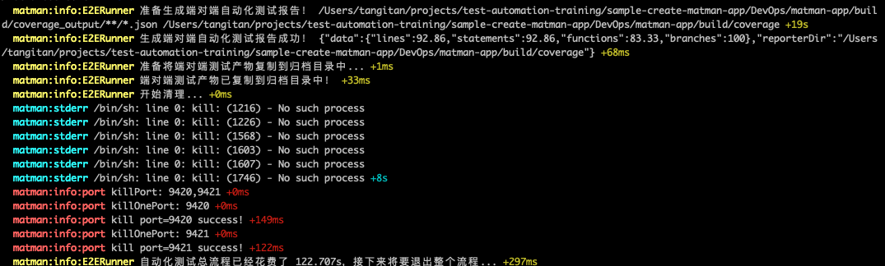
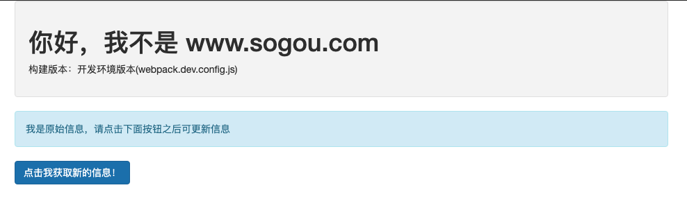

本教程带你从零理清matman自动化测试解决方案.

## 初始化

```bash
$ npx create-matman-app new [文件名] 
```

此时顺利的话你会看到一个名为DevOps的文件夹，说明脚手架已运行成功！

## 尝试运行端对端测试

此时运行，先尝试下自动化测试的过程：

```bash
$ npm run test:e2e
```

在脚本执行结束会看到如下的截图：



这就是一次完整的自动化测试执行的过程。但相信你还对整个方案不很了解。下面带你一步一步完成整个方案的完整执行过程。


## 第一步：运行当前sogou页面


### 构建

```bash
$ npm run build-dev
```

### 设置whistle

```bash
# cd到DevOps/whistle目录
$ cd DevOps/whistle
# 创建代理规则
$ npm run use-dev
```

> 注意：给whistle前记得开启whistle。whistle学习推荐链接：[点这里](https://segmentfault.com/a/1190000016058875?utm_source=tag-newest) 当然也可以去看官网：[点这里](https://wproxy.org/whistle/)

### 运行mockstar

```bash
# cd到DevOps/mockstar-app目录
$ cd DevOps/mockstar-app
# 创建代理规则
$ npm run start
```

本地打开 [http://127.0.0.1:9527/](http://127.0.0.1:9527/)  会看到目前所mock的接口数据；

此时本地打开 [http://www.sogou.com/ ](http://www.sogou.com/ ) sogou.html会看到如下页面：



##  第二步 添加一个github接口体验整个方案过程

第二步结束后最终我们看到的页面如下所示：


## 1.  在src/sogou.js中添加操作逻辑

```js
// ...

function changeUser() {
  const userName = $('.github-user-name').text();
  if (userName !== 'yyx990803') {
    // https://github.com/yyx990803
    fetchUser('yyx990803', 'Evan You');
  } else {
    fetchUser('Jinjiang', 'Jinjiang');
  }
}

$(function () {
  console.log('jQuery loaded!');
  changeUser(); 
  $('#click').click(function() {
    changeUser();
  });
  bindClickEvent();
});
// ...

```

### 2. 在public/index.html中添加页面内容 

```html
<button id="click" type="button" class="btn btn-primary">click to change</button>
<div class="github-user-name"></div>
<div>
  <a href="" class="github-html-url" target="_blank"></a>
</div>
<div>
  
</div>
```

### 3. 添加页面操作脚本

在matman中新建`DevOps/matman-app/case_modules/users`文件夹，在文件夹下添加`basic-check-request.js`文件。添加操作脚本：

```js
const path = require('path');
const { createPageDriver } = require('../../helpers');

module.exports = async pageDriverOpts => {
  // 创建 PageDriver
  const pageDriver = await createPageDriver(__filename, pageDriverOpts);

  // 页面地址
  await pageDriver.setPageUrl('https://www.sogou.com/sogou.html');

  // 设置浏览器设备型号
  await pageDriver.setDeviceConfig('pc');

  // 初始化
  await pageDriver.addAction('init', async page => {
    await page.waitFor('#main');
    await page.waitFor(1000);
  });

  await pageDriver.addAction('click to change', async page => {
    await page.click('#click');
    await page.waitFor(1000);
  });

  await pageDriver.addAction('click to change again', async page => {
    await page.click('#click');
    await page.waitFor(1000);
  });

  return await pageDriver.evaluate(path.resolve(__dirname, './crawlers/get-page-info-request.js'));
};
```

### 4. 添加爬虫脚本

在matman中新建`DevOps/matman-app/case_modules/users/crawlers/get-page-info-request.js`文件，添加爬虫脚本：

```js
const { useJquery } = require('web-crawl-util');

module.exports = () => {
  return {
    info: getGithubInfo(),
    remarks: 'Got data by npm package: web-crawl-util'
  };
};

function getGithubInfo() {
  const parentSelector = '.container';
  const result = {
    isExit: useJquery.isExist(parentSelector)
  }
  if (result.isExit) {
    result.githubName = useJquery.getText('.github-user-name', parentSelector)
    result.githubURL = useJquery.getText('.github-html-url', parentSelector)

  }
  return result;
}
```

### 5. 添加mock数据

mock的数据不好罗列代码，可自行查看当前教程的`mockstar-app/mock_server/users`文件夹。

### 6. 添加代理

查看DevOps/whistle文件夹下的index.js会发现新增了如下一行代码：

```js
`www.sogou.com/search/users 127.0.0.1:${mockstarPort}`,
```

该代码就是用来将请求的地址代理到mock地址上面，从而让页面获取上一步创建的数据。

### 7. 编写测试用例

在当前文件夹下的`test/e2e`下面新建js文件，添加了如下测试用例：

```js
const { expect } = require('chai');
const checkPage = require('../../../DevOps/matman-app/case_modules/users/basic-check-request.js');

/**
 * @author tangitan
 * @priority P1
 * @casetype e2e
 */
describe('端对端测试样例', function() {
    this.timeout(30000);
    let resultData;

    before(async function () {
        resultData = await checkPage({
            show: false,
            useRecorder: true,
            doNotCloseBrowser: true,
            queryDataMap: {
                users: 'success_base'
            }
        });
    });
    it('初始名称为yyx990803', () => {
        expect(resultData.get('init').info.githubName).to.be.equals('yyx990803');
    });

    it('点击按钮后更改为Jinjiang', () => {
        expect(resultData.get('click to change').info.githubName).to.be.equals('Jinjiang');
    });

    it('再次点击名称变回yyx990803', () => {
        expect(resultData.get('click to change again').info.githubName).to.be.equals('yyx990803');
    });
}) 
```

### 8. 运行命令获取结果

```bash
$ npm run e2e
```

如果你本地环境已经搭建完毕(mockstar已启动，whistle代理配置已配好)，那么可以直接去运行：

```bash
$ npm run test:e2e:direct
```
获取当前测试用例的执行结果