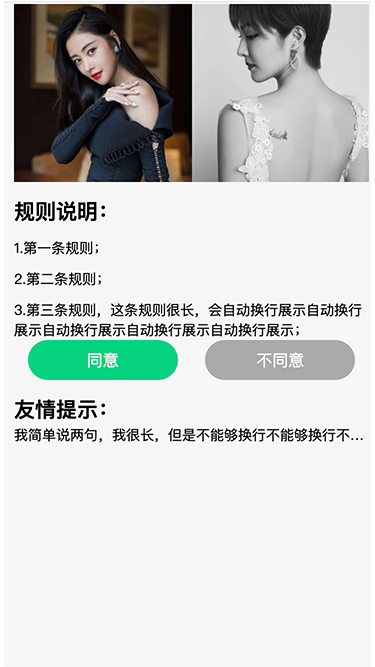
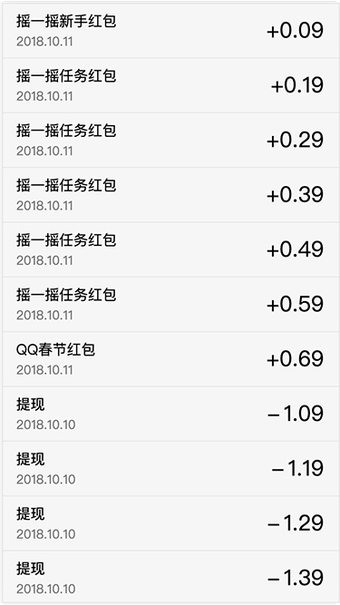
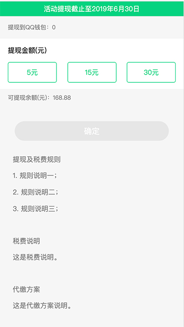

# matman 自动化测试演示项目

本项目是 [matmanjs](https://matmanjs.github.io/matman/) 的配套演示项目，提供了一些示例，详解了如何使用 matman 这套框架来做端对端测试。

## 1. 项目介绍

本项目是基于 [create-react-app](https://github.com/facebook/create-react-app)  来初始化项目，构造了一些典型场景，并为之准备了自动化测试用例。

自动化测试相关的代码模块，涉及到的框架和工具包括但不限于如下，更多资料请请查阅 [脚手架：create-matman-app 使用指南](https://matmanjs.github.io/matman/tool/create-matman-app.html) 。

- 测试框架：[Mocha](https://mochajs.org/) 
- 断言库：[Chai](https://www.chaijs.com/)
- 代理工具：[Whistle](https://github.com/avwo/whistle)
- mock 工具：[MockStar](https://github.com/mockstarjs/mockstar)
- web 端对端测试框架：[Matman](https://github.com/matmanjs/matman)

## 2. 命令

本项目是一个可以完整运行的项目，首先需要安装依赖：

```bash
$ npm install
```

执行如下命令即可启动开发，而在开发模式下，会默认启动 `3000` 端口，正常情况下会自动打开浏览器并加载 `http://localhost:3000/` 页面。

> 若有需要请查阅 [create-react-app 官方文档](https://create-react-app.dev/) 。

```sh
# 开发模式启动项目
$ npm start
```


### 2.1 直接运行测试命令

直接运行如下命令之后，则开始自动执行测试命令，其过程包括了（详见 `test/run-e2e-test.js` 文件）：

- 第一步：构建项目
- 第二步：启动 mockstar，用于本地构建 mock server
- 第三步：启动 whistle 并设置代理规则
- 第四步：启动 matman，提供了无头浏览器，用于 web 端对端测试时被测试文件调用
- 第五步：使用 mocha 执行测试文件

```bash
# 执行单元测试和 web 端对端测试
$ npm test

# 执行 web 端对端测试
$ npm run test:e2e

# 执行 web 端对端测试，同时展示无头浏览器，可用于调试
$ npm run test:e2e:show
```

### 2.2 开发调试

自动化测试过程根据不同项目特点，可能包括很多步骤，例如 2.1 章节中提到的五步。但从分阶段来看，无外乎分为两个阶段：

- 准备测试环境阶段，即 Server Under Test 阶段，简称 SUT，上述的第 1-4 步属于此阶段
- 执行测试文件阶段，即使用 Mocha 或者 Jest 执行测试命令，上述的第 5 步属于此阶段

#### 2.2.1 准备测试环境

开发调试阶段时，准备测试环境可以通过自定义自动化脚本来启动，也可以人工启动。

> 检查是否已经准备好的办法：可以打开 `https://now.qq.com/simple` 页面（本项目涉及的页面请查看 "4. 页面介绍" 一章），同时设置浏览器走代理服务器 `http://127.0.0.1:8899`，若页面访问正常，则说明已准备好。


##### 2.2.1.1 方式一：自动化脚本准备（推荐）

```bash
# 本地开发版本的自动化测试准备
$ npm run test:e2e:bootstrap:dev

# 生产版本的自动化测试准备
$ npm run test:e2e:bootstrap
```

##### 2.2.1.2 方式二：人工准备

即按照 2.1 章节提到的第 1-4 步 执行，适合在开发调试时使用，具体来说为：

- 启动项目构建，在本例中，执行 `npm run build-dev` 启动本地调试，执行 `npm run build-prod` 启动生产版本构建
- 进入到 `DevOps/mockstar-app` 目录下，首先执行 `npm install` 安装依赖，然后执行 `npm start` 启动 mock server 服务（默认 mock server 服务地址为： `http://127.0.0.1:9527`）
- 执行 `w2 start` 启动 whistle （需要全局安装 `npm install whistle -g`，默认代理服务地址：`http://127.0.0.1:8899`），同时设置好代理规则。在本例中，进入到 `DevOps/whistle` 目录下，执行 `npm run use-dev` 使用本地调试代理，执行 `npm run use-prod` 启动生产版本代理
- 进入到 `DevOps/mockstar-app` 目录下，执行 `npm install` 安装依赖

> 虽然步骤很多，但是如果你目前正处于开发阶段，那么这些步骤实际上已经被执行过了。


#### 2.2.2 执行测试文件

```bash
# 使用 mocha 执行测试文件
$ npm run test:e2e:direct
```

## 3. 设置代理

本项目提供了几个页面，我们需要借助代理来访问，通过自定义自动化脚本来动态设置，也可以手动设置。

### 3.1 方式一：动态设置代理

推荐使用 [whistle](https://github.com/avwo/whistle) 来设置代理，运行如下命令自动设置代理，具体可以阅读 [DevOps/whistle/README.md](./DevOps/whistle/README.md) 。

```
# 开发场景
$ npm run use-whistle-dev

# 生产环境
$ npm run use-whistle-prod
```

### 3.2 方式二：手动设置代理

也可以自己手动设置，其中 `[project_path]` 为本地项目的绝对路径，需要按实际情况替换。

> 默认情况下，开发场景项目启动端口为 `3000`， mockstar 启动端口为 `9527` 。

场景一： 开发场景，代理如下：

```
cgi.now.qq.com/cgi-bin 127.0.0.1:9527
now.qq.com/maybe/report statusCode://200
now.qq.com 127.0.0.1:3000
now.qq.com/manifest.json [project_path]/public/manifest.json
```

场景二： 生产环境，代理如下：

```
cgi.now.qq.com/cgi-bin 127.0.0.1:9527
now.qq.com/maybe/report statusCode://200
now.qq.com/manifest.json [project_path]/build/manifest.json
/^https?://now\.qq\.com/static/(.*)$/ [project_path]/build/static/$1
/^https?://now\.qq\.com/([\w\-]*)(.*)$/ [project_path]/build/index
```

## 4. 页面介绍

### 4.1 简单静态页面(simple)

移动端 H5 纯静态页面，无接口请求，无用户操作。

- 调试地址: https://now.qq.com/simple




### 4.2 单一接口展示型页面(transaction)

移动端 H5 页面，依赖一条接口数据来展示。

- 调试地址: https://now.qq.com/transaction




### 4.3 重交互页面(withdraw)

移动端 H5 页面，依赖多条接口数据来展示，且有多个用户交互逻辑。

- 调试地址: https://now.qq.com/withdraw


